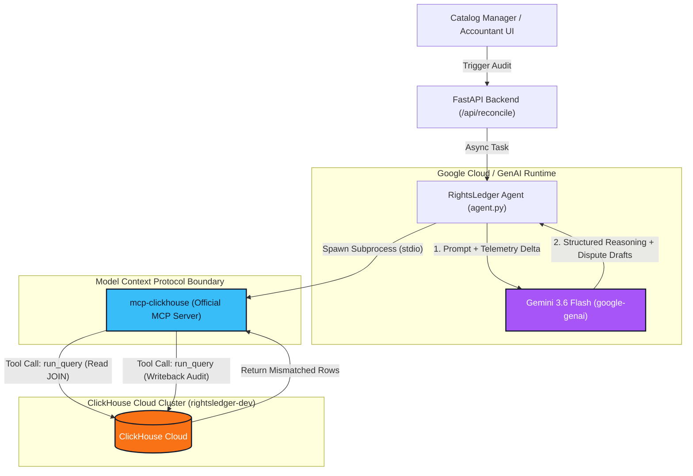

# RightsLedger: Autonomous Royalty & Rights Reconciliation Agent

RightsLedger is an autonomous financial intelligence agent built for the Google Cloud **"Agentic Cinema: The Blockbuster Hackathon"** (ClickHouse Partner Track). It automates the reconciliation of media licensing and streaming telemetry statements against contracted rate cards, flags discrepancies, reasons over root causes, drafts distributor dispute communications, and writes immutable audit records back to ClickHouse Cloud via Model Context Protocol (MCP).

---

## 🎬 Problem Statement & Industry Impact

In the media, entertainment, and streaming distribution ecosystem, rights holders and independent studios receive monthly and quarterly royalty statements across dozens of platforms (e.g., Netflix, Prime Video, Hulu, Disney+). 

* **Revenue Leakage:** Industry studies show 8% to 15% of digital royalty statements contain underreporting, tier mismatches, or missing play periods.
* **Audit Latency:** Manually cross-referencing millions of play event logs against dynamic, territory-specific rate cards in spreadsheets takes accounting teams weeks—often blowing past 60-day contractual dispute windows.
* **The Solution:** RightsLedger runs continuous, high-speed joins on streaming telemetry in ClickHouse Cloud, invokes Gemini to analyze discrepancies $>2\%$, drafts dispute notices, and commits audit trails autonomously.

---

## 🏗️ Architecture



---

## ⚡ How This Satisfies the ClickHouse Track Requirement

To satisfy the hackathon's ClickHouse partner track guidelines:

1. **Official MCP Server:** RightsLedger interacts with ClickHouse Cloud **exclusively** through the official [`mcp-clickhouse`](https://github.com/ClickHouse/mcp-clickhouse) Model Context Protocol server rather than direct or proprietary database drivers.
2. **`stdio` Subprocess Transport:** The agent spawns the `mcp-clickhouse` executable in an isolated environment with secure environment parameters (`CLICKHOUSE_HOST`, `CLICKHOUSE_PORT=8443`, `CLICKHOUSE_SECURE=true`).
3. **Bi-Directional Tool Orchestration:**
   * **Read Phase:** Invokes `run_query` tool to execute high-performance analytical joins between `reported_plays` and `expected_rates`.
   * **Write Phase:** Invokes `run_query` tool to persist structured discrepancy findings, calculated deltas, and generated email drafts directly into the `discrepancies` audit table.

---

## 🛠️ Tech Stack

* **AI / Agentic Framework:** `google-genai` SDK powered by **Gemini 3.6 Flash**
* **Protocol Layer:** Model Context Protocol (`mcp` + `mcp-clickhouse`)
* **Database / Data Warehouse:** ClickHouse Cloud
* **Backend Framework:** Python 3.11, FastAPI & Uvicorn
* **Deployment Target:** Google Cloud Run

---

## 🚀 Setup & Local Run Instructions

### 1. Clone the Repository
```bash
git clone https://github.com/ahmadu2305/rightsledger.git
cd rightsledger
```

### 2. Create and Activate Virtual Environment
```bash
python -m venv venv
source venv/bin/activate
```

### 3. Install Dependencies
```bash
pip install -r requirements.txt
```

### 4. Configure Environment Variables
Create a `.env` file in the root directory:
```env
CLICKHOUSE_HOST=your_cluster_hostname_only.clickhouse.cloud
CLICKHOUSE_PORT=8443
CLICKHOUSE_SECURE=true
CLICKHOUSE_USER=default
CLICKHOUSE_PASSWORD=your_cluster_password
CLICKHOUSE_ALLOW_WRITE_ACCESS=true
GOOGLE_GENAI_API_KEY=your_gemini_api_key
GEMINI_MODEL=gemini-3.6-flash
```

### 5. Run the Application
```bash
python main.py
```
Open **`http://localhost:8080`** in your browser to run the reconciliation agent.

---

## 🛡️ Security Architecture: Prompt Injection Defense by Design

Media rights statements and distributor play counts frequently ingest untrusted external strings (e.g., metadata, movie titles, report notes). RightsLedger incorporates a multi-tiered **Defense-by-Design** security architecture to prevent prompt injection and unauthorized financial ledger mutation:

```
[ UNTRUSTED DATA: ClickHouse / Distributor Telemetry ]
                           │
                           ▼
[ 1. Instruction / Data Isolation: <untrusted_distributor_payload> ]
                           │
                           ▼
[ 2. Controlled Generation: response_schema=DiscrepancyBatchAnalysis ]
                           │
                           ▼
[ 3. Gemini 3.6 Flash Reasoning: Classify & Draft (Advisory Only) ]
                           │
                           ▼
[ 4. DETERMINISTIC POLICY GATE: Math Lock & Action Allowlist ]
                           │
                           ▼
[ 5. Tool-Gated Writeback: Immutable Audit Persistence in ClickHouse ]
```

1. **Instruction / Data Isolation:** System instructions are isolated at the API configuration layer. All ClickHouse data is enclosed inside `<untrusted_distributor_payload>` tags, instructing the model never to interpret data as executable commands.
2. **Native Controlled Generation (`response_schema`):** Schema validation is enforced at the Gemini API level (`google-genai` SDK) and verified via Pydantic on the client.
3. **Tool Execution Allowlist:** MCP `run_query` calls are strictly restricted to allowlisted `SELECT` and `INSERT INTO discrepancies` operations. Administrative SQL commands (`DROP`, `TRUNCATE`, `ALTER`, `SYSTEM`) are blocked deterministically.
4. **Deterministic Financial Math Lock:** Gemini is an advisory reasoning layer—not the financial authority. Application code deterministically computes `expected_payout = play_count * rate_per_play` and `delta = reported - expected`. Prompt overrides cannot alter these values.
5. **Deterministic Policy Gate:** Validates record existence, variance thresholds ($>2\%$), confidence scores ($\ge 0.60$), and allowlisted actions before authorizing database writebacks.

---

## 🔬 Related Work & Inspiration

RightsLedger's "Prompt Injection Defense by Design" architecture (instruction/data isolation, deterministic policy gating, structured output validation) draws on *CaMeL: Defeating Prompt Injections by Design* (Debenedetti et al., Google DeepMind / Google / ETH Zurich), which I learned about through an Agentic AI Foundation (AAIF) MLOps webinar. Their core insight—that an LLM should reason and recommend, but a deterministic system must remain the authority for consequential actions—directly shaped the Policy Gate design between Gemini's reasoning and any ClickHouse write.

* **Reference:** [google-research/camel-prompt-injection](https://github.com/google-research/camel-prompt-injection)

---

## 🧪 Running the Test Suite

RightsLedger includes a comprehensive test suite covering normal reconciliation, underpayments, overpayments, malicious title injections, unauthorized action suppression, and SQL allowlist enforcement:

```bash
python test_suite.py
```

Expected Output:
```text
........
----------------------------------------------------------------------
Ran 8 tests in 0.001s

OK
```

---

## 📜 License

Distributed under the Apache-2.0 License. See `LICENSE` for details.
---

## 🔬 Related Work & Inspiration

RightsLedger's "Prompt Injection Defense by Design" architecture (instruction/data
isolation, deterministic policy gating, structured output validation) draws on
CaMeL: Defeating Prompt Injections by Design (Debenedetti et al., Google DeepMind
/ Google / ETH Zurich), which I learned about through an Agentic AI Foundation
(AAIF) MLOps webinar. Their core insight — that an LLM should reason and
recommend, but a deterministic system must remain the authority for consequential
actions — directly shaped the Policy Gate design between Gemini's reasoning and
any ClickHouse write.

Reference: https://github.com/google-research/camel-prompt-injection
